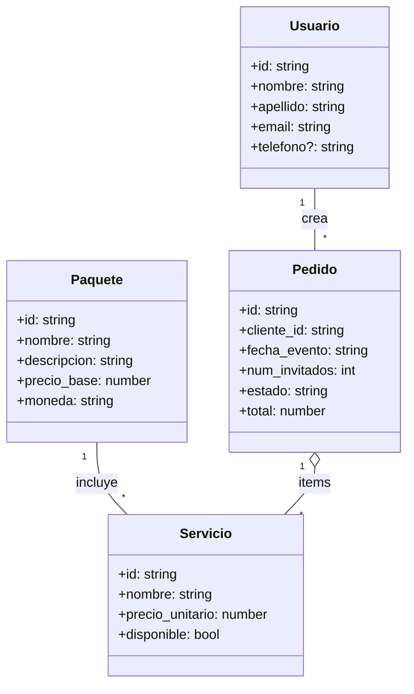
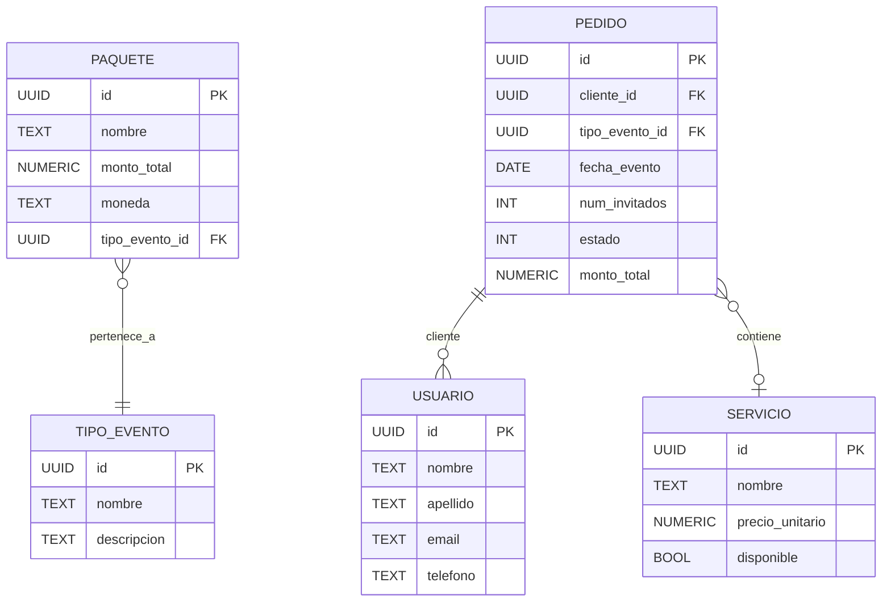
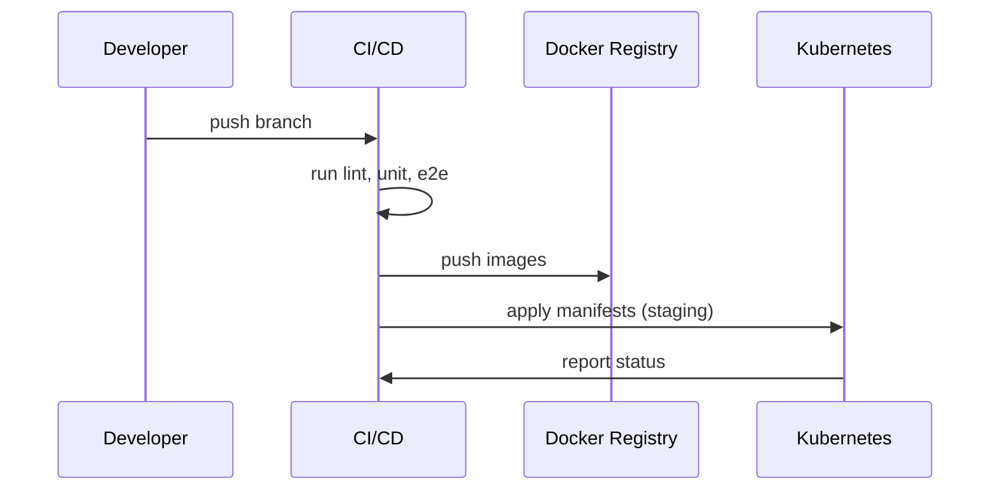

% Resumen Final: Proyecto Eventos-Perú (Hexagonal)

Fecha: 27-11-2025

Resumen: este documento recoge la planificación, arquitectura, diseño, pruebas, despliegue y mantenimiento del proyecto "Eventos-Perú" (arquitectura hexagonal con microservicios y frontend en Vue3). Incluye diagramas, cuadros de decisión y propuestas para pruebas y operaciones.

--

**Contenido**

- Planificación del proyecto
- Definición de objetivos y alcance
- Análisis de requerimientos
- Diseño de la arquitectura
- Tecnologías usadas
- Diagrama de clases
- Modelamiento de base de datos
- Implementación de patrones
- Arquitectura por capas
- Pruebas de software
  - Pruebas unitarias
  - Pruebas funcionales
  - Pruebas de integración
  - Pruebas de rendimiento
  - Pruebas de seguridad (penetración, vulnerabilidades, control de accesos)
- Plan de despliegue
- Plan de monitoreo
- Plan de mantenimiento
- Repositorio de código y control de versiones
- Reportes estadísticos

--

**1. Planificación del proyecto**

- Duración estimada: 4–6 semanas para primer release estable (features core + UX polish + tests automatizados). Despliegue + CI/CD: 1–2 semanas adicionales.
- Fases:
  1. Descubrimiento y levantamiento de requisitos (2–3 días).
  2. Implementación core frontend (Usuarios, Perfil, Catálogo) (3–5 días).
  3. UX & pruebas (1 semana).
  4. E2E y Playwright/CI (3–4 días).
  5. Docker/Despliegue y monitoreo (1–2 semanas).
  6. Buffer / Contingencias (1 semana).

**Métricas de éxito**
- 100% de endpoints críticos integrados con frontend.
- 90% de cobertura de flujos E2E automatizados.
- Tiempos de respuesta del frontend < 300ms en navegación estándar.

--

**2. Definición de objetivos y alcance**

Objetivo principal: Entregar un frontend unificado conectado al API Gateway que soporte flujos administrativos y de cliente (consulta catálogo, crear pedidos, gestionar pedidos y usuarios) sin tocar la lógica de backend.

Alcance (MVP):
- Frontend funcional para login (IAM), catálogo, CRUD TiposEvento/Servicios/Paquetes, Pedidos (cliente y admin), Usuarios (admin).
- Dev tooling: scripts de integración, E2E automatizados con Playwright.
- UX básico consistente: confirmaciones, toasts, modales y loading states.

Exclusiones en MVP: sistema de pagos, analytics avanzados, PWA completo, exportación avanzada de reportes.

--

**3. Análisis de requerimientos**

- Requerimientos funcionales (ejemplos):
  - Autenticación con IAM vía API Gateway.
  - Listar/filtrar TiposEvento, Servicios, Paquetes.
  - Crear/editar/cancelar Pedidos (cliente y admin) respetando las reglas del backend (PATCH para cambios de estado, cancelación por estado).
  - CRUD de Usuarios (admin) y edición de Perfil (cliente).

- Requerimientos no funcionales:
  - Respuesta <500ms para endpoints cacheables.
  - 99% uptime del API Gateway en entorno de staging.
  - Mecanismos de logging centralizado y métricas tiempo real.

--

**4. Diseño de la arquitectura**

Descripción: Arquitectura de microservicios con API Gateway (FastAPI) que enruta a servicios (IAM, Catálogo, Contratación, Proveedores). Frontend SPA (Vue3 + Vite + TypeScript) consume el Gateway bajo prefijo `/api`.

Merits: separación de responsabilidades, despliegues independientes, escalabilidad por servicio.

Diagrama de alto nivel (Mermaid):

```mermaid
flowchart LR
  subgraph Frontend
    F[Vue3 App (Vite, Pinia, TS)]
  end
  subgraph Gateway[API Gateway (FastAPI)]
    GW[/api/*]
  end
  subgraph Services
    IAM[IAM Service]
    CAT[Catálogo Service]
    CONTR[Contratación Service]
    PROV[Proveedores Service]
  end
  F -->|HTTP /api/*| GW --> IAM
  GW --> CAT
  GW --> CONTR
  GW --> PROV
  note right of CONTR: Versionado /v1 en endpoints
```

Detalles operativos:
- Vite dev proxy debe preservar prefijo `/api` para evitar reescrituras que generan `/api/api/...` y 404.
- Normalización de contratos en cliente: mapear `monto_total_vigente`/`monto_total` a `precio_base` para la UI.

--

**5. Tecnologías usadas**

- Frontend: Vue 3, Vite, TypeScript, Pinia, Vue Router, Tailwind CSS, Axios.
- Testing: Playwright (@playwright/test), pytest para scripts E2E / integración, herramientas internas (scripts Python).
- Backend (existente): FastAPI microservices (IAM, Catálogo, Contratación, Proveedores), PostgreSQL (asumido), gateway reverso.
- DevOps: Docker, docker-compose (propuesta), Kubernetes manifests (propuesta), Prometheus + Grafana para monitoreo.
- CI: GitHub Actions / Azure DevOps / GitLab CI (ejemplo) — pipelines para lint, build, test y deploy.

--

**6. Diagrama de clases (frontend — modelo simplificado)**



--

**7. Modelamiento de base de datos (ER simplificado)**



Notas: usar UUIDs consistentes (el proyecto tiene varios UUIDs seed), normalizar montos a `monto_total` con `moneda`.

--

**8. Implementación de patrones**

- Arquitectura Hexagonal (Ports & Adapters): los microservicios exponen puertos HTTP; el Gateway actúa como adaptador de entrada.
- Patrón Repository en services para acceso a BD.
- DTOs + mappers para normalizar respuestas (ej. cliente normaliza `monto_total_vigente` → `precio_base`).
- Circuit Breaker / Retry (operacional): implementar a nivel de Gateway o infra (envoy/istio) para resiliencia.

--

**9. Arquitectura por capas (Frontend)**

- Capa de Presentación: Vue components, views.
- Capa de Estado / Lógica: Pinia stores (auth, catalog, orders, ui).
- Capa de Servicios / API: `src/api/*` (axios clients) — centralizan normalización de respuesta y manejo de errores.
- Capa de Infraestructura: Vite dev server, env variables (`VITE_API_BASE_URL`), proxy config.

Beneficio: separación clara de responsabilidades, facilidad de testeo unitario de stores y servicios.

--

**10. Pruebas de software**

Estrategia: combinación de pruebas unitarias, de integración y E2E. Ciclo: local dev → CI (unit + lint) → staging (E2E + carga) → prod (smoke & observability).

- Herramientas:
  - Unit tests: vitest / jest (frontend), pytest (backend)
  - E2E: Playwright (frontend headless), scripts Python para flujos integrados
  - Integración: pytest + scripts específicos (ya existentes en `tools/`)
  - Performance: locust / k6
  - Security: OWASP ZAP / manual pentest

--

**11. Pruebas unitarias**

- Frontend: testear stores (Pinia), utilitarios (formatters), componentes críticos con mounting ligero.
- Cobertura recomendada: mínimo 60% para MVP, ideal >80% en módulos críticos (auth, orders, catalog).

Ejemplo: test para normalization catalog client: asegurar `precio_base` siempre presente.

--

**12. Pruebas funcionales**

- Validar flujos de negocio principales: login, crear pedido, ver pedidos, admin asigna proveedor.
- Herramienta: Playwright para navegación + verificaciones DOM y screenshots.

Observación: ya existen scripts `tools/test_gateway_integration.py` y tests pytest E2E que validan flujos via HTTP; complementarlos con Playwright UI asegura integración visual.

--

**13. Pruebas de integración**

- Tests que ejercitan Gateway + microservicios reales (ya implementado en `tools/test_gateway_integration.py` y `tools/test_e2e_flows.py`).
- Ejecutar en CI con staging env (variables apuntando a staging services). Validar contratos (status codes y campos esperados).

--

**14. Pruebas de rendimiento**

- Objetivos: medir latencia por endpoint y throughput; buscar cuellos en catálogo y contrataciones.
- Herramientas: `k6` o `locust`.

Ejemplo carga: simular 200 RPS al endpoint `GET /api/catalogo/v1/paquetes` durante 5 minutos, observar 95pct latency < 500ms.

--

**15. Pruebas de seguridad**

Subáreas:
- Pruebas de penetración (pentest): pruebas auth bypass, CSRF, XSS en contenidos renderizados, pruebas de endpoints admin.
- Análisis de vulnerabilidades: escaneo SCA (dependabot, snyk) + SAST en CI.
- Pruebas de control de accesos: asegurar que endpoints admin devuelvan 403 para clientes.
- Pruebas de inyección: SQL/NoSQL injection, inyección en parámetros de búsqueda.

Recomendación de checklist rápido:
1. Ejecutar OWASP ZAP scan en staging.
2. Validar cabeceras de seguridad (CSP, HSTS, X-Frame-Options).
3. Revisar almacenamiento de tokens y expiración (frontend usa localStorage actualmente; evaluar HttpOnly cookies para mayor seguridad).

--

**16. Plan de despliegue**

Propuesta mínima para environments: `dev`, `staging`, `production`.

- Docker-compose para desarrollo (local): orquestar gateway + microservicios + DB + frontend en modo `vite` o `nginx`.
- Dockerfiles: crear `Dockerfile.api` (ya en `deploy/`), `Dockerfile.frontend` para build static assets.
- Kubernetes manifests: namespace por ambiente, deployments, services, ingress con TLS.
- CI job (ejemplo GitHub Actions):
  1. Lint + typecheck (TS)
  2. Unit tests
  3. Build frontend (vite build)
  4. Integration tests (test_gateway_integration)
  5. Build & push images
  6. Deploy to staging

Diagrama (Mermaid):



--

**17. Plan de monitoreo**

- Métricas a recolectar:
  - Latencia por endpoint (p95, p99)
  - Throughput (RPS) por servicio
  - Errores 5xx/4xx
  - Uso CPU/RAM por pod
  - Saturación de DB (conexiones)

- Stack recomendado:
  - Prometheus (metrics exporters + serviceMonitors)
  - Grafana (dashboards para Gateway, servicios, frontend build & errors)
  - Loki (logs centralizados) + Grafana Explore
  - Alertmanager (alertas por SLAs)

- Dashboards sugeridos:
  - Overview: availability, total requests, error rate
  - Latency per endpoint: p50/p95/p99
  - Database: slow queries, connections

Alertas críticas:
- Error rate > 1% por 5m
- p95 latency > 1s por 5m
- Pod crashloop > 3 restarts en 1m

--

**18. Plan de mantenimiento**

- Mantenimiento preventivo: actualizar dependencias trimestralmente, revisar SCA semanalmente.
- Backups: dumps diarios de la base de datos, retención 30 días en almacenamiento seguro.
- Rotación de secretos: use de vault (Hashicorp Vault o Kubernetes Secrets con control de acceso) y rotación periódica.
- Runbook de incidentes: pasos para triage, rollback, y comunicación.

--

**19. Repositorio de código y control de versiones**

- Branching model recomendado: Git Flow simplificado / trunk-based con feature branches.
- Convenciones:
  - Branches: `feature/<ticket>`, `fix/<ticket>`, `hotfix/<ticket>`
  - Commits: usar conventional commits (`feat:`, `fix:`, `chore:`)
  - PRs: requerir 1 reviewer + CI green

- Estructura repo (actual):
  - `frontend/` (Vue3, tests, config)
  - `services/` (microservicios)
  - `deploy/` (docker/k8s manifests)
  - `tools/` (scripts de test e2e)

--

**20. Reportes estadísticos**

Proveer reportes automáticos en CI o dashboard diario:

- Uso: número de pedidos por día, por tipo de evento.
- Conversión: visitas → pedidos (si se registra con analytics en frontend).
- Errores: top endpoints 5xx, tasa de errores por servicio.

Ejemplo de tabla resumen diario (CSV):

| Fecha | Pedidos totales | Pedidos cancelados | Ingresos S/ | Errores 5xx |
|---|---:|---:|---:|---:|
| 2025-11-25 | 42 | 3 | 45,200.00 | 2 |
| 2025-11-26 | 57 | 1 | 72,450.00 | 0 |

Gráficos sugeridos:
- Series temporales: Pedidos por día
- Pie: Reparto por tipo de evento
- Heatmap: Tráfico por hora/día

--

**Anexos — Artefactos ya presentes en el repo**

- `tools/test_gateway_integration.py` — script de smoke/integración para gateway y frontend. (Ejecutado: 6/6 tests OK)
- `tools/test_e2e_flows.py` — flujos integrados (cliente/admin/integrado). (Ejecutado: 3/3 OK)
- `frontend/tests/*` — Playwright tests añadidos (smoke + auth test parcial).

--

**Tareas siguientes recomendadas (acorde a priorización)**

1. Completar Gestión de Usuarios (CRUD) y pruebas E2E para esos flujos.  (Alta)
2. Finalizar limpieza TypeScript y eliminar casts `any` introducidos temporalmente. (Media-Alta)
3. Extender Playwright tests para cubrir full flows: login → crear pedido → admin asigna proveedor → cliente confirma. Guardar artefactos en CI. (Alta)
4. Implementar Docker Compose para dev y pipeline CI básico. (Media)
5. Configurar Prometheus + Grafana en staging y añadir alertas críticas. (Media)

--

Si quieres, puedo:

- Generar los archivos de configuración de CI (ej. GitHub Actions) con etapas sugeridas.
- Implementar la Gestión de Usuarios (Admin) y añadir pruebas Playwright para ese flujo.
- Preparar `docker-compose.dev.yml` y `Dockerfile.frontend` listo para build.

Dime qué prefieres que haga primero y procedo con los artefactos (commits locales listos para PR si lo autorizas).

--

Documento generado por el equipo técnico — para feedback y ajustes por prioridad.

*** Fin del documento ***
